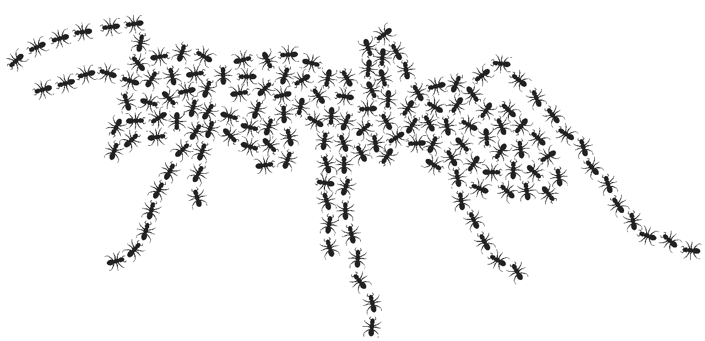

.. Marabunta documentation master file, created by
   sphinx-quickstart on Tue Oct 17 22:32:43 2017.
   You can adapt this file completely to your liking, but it should at least
   contain the root `toctree` directive.

***************************************************
Bienvenue dans la documentation du projet Marabunta
***************************************************

  
**Un jeu multi-agents avec des fourmis.**

.. toctree::
   :maxdepth: 2
   :caption: Sommaire:

   Page0
   Page1
   Page2
   protocol
   Page3
   Page4
   Page5

.. Indices and tables
.. ==================
.. 
.. * :ref:`genindex`
.. * :ref:`modindex`
.. * :ref:`search`
