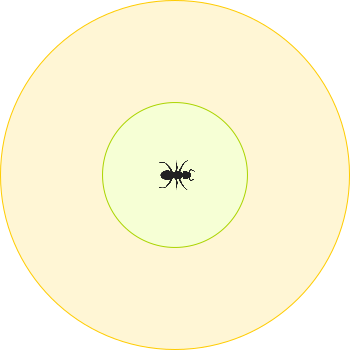

=========
Protocole
=========

Ce document décrit le protocole de communication entre le programme de
"stratégie" et le "simulateur".

Généralités
===========

Communication
-------------

Par commodité pour le programme de stratégie, la communication s'effectue à
travers ses propres flux d'entrée et de sortie standards (`stdin`, `stdout`).
Il s'agit d'un protocole au format textuel.

.. NOTE::
   Les flux d'entrée et de sortie standards sont les mêmes que vous utilisez
   habituellement pour dialoguer avec votre programme en console ou via votre
   IDE. Ne cherchez pas plus compliqué.

.. NOTE::
   Cela signifie aussi qu'il est facile de vérifier le comportement de votre
   stratégie en lui envoyant vous-même des données avant de le soumettre au
   simulateur.

Les données sont transmises ligne par ligne (délimitées par un caractère
LF=0x0A=10) avec un maximum de 100 caractères par ligne (saut de ligne inclus).
Chaque ligne contient une seule commande avec des arguments séparés par des
espaces.

Il y a deux types d'entités dont votre programme doit définir les actions selon
votre stratégie : chaque fourmi et la fourmilière.

Ci-après, nous faisons la distinction entre les `informations` que l'entité
perçoit à propos de son environnement proche et les `actions` qui sont les
opérations qu'elle peut réaliser.

En pratique, le programme de stratégie reçoit d'abord un marqueur de début de
dialogue (`BEGIN ANT` dans le cas d'une fourmi, `BEGIN NEST` dans le cas de la
fourmilière). Suivent ensuite l'ensemble des `informations` perçues puis la
commande `END`.

C'est ensuite à votre programme d'indiquer les actions à réaliser. Attention,
les actions dites exclusives ne sont pas cumulables. Votre programme termine la
liste des actions réalisées avec le marqueur `END` et se met en écoute d'un
éventuel marqueur de début pour une nouvelle entité.

.. WARNING::
   Notez qu'il est important de respecter l'ordre de parole (i.e. bien attendre
   d'avoir reçu `END` avant d'indiquer les actions), de n'indiquer qu'un seul
   `END` en fin de liste d'actions et de ne pas utiliser plusieurs commandes
   exclusives.
  
   Dans le cas contraire, le simulateur est libre de faire ce qu'il veut comme
   attribuer certaines actions à d'autres entités, ignorer les commandes ou même
   tuer vos fourmis.

Perception de l'environnement
-----------------------------

Les fourmis n'étant pas omniscientes, elles ont une perception limitée à leur
environnement proche. Nous distinguons les éléments à portée (`NEAR`) avec
lesquels il est possible d'interagir (zone verte sur le schéma ci-dessous), et
les éléments qui sont seulement dans le champ visuel (`FAR`) avec lesquels il
est seulement possible de s'orienter (zone orange). Au-delà, la fourmi ignore
ce qu'il se passe (zone blanche).

Aléatoire
---------

Les fourmis n'explorent pas en ligne droite, la sortie de la fourmillière se
fait avec un azimut indéterminé et changeant, les actions des autres équipes ne
sont pas prédictibles, le système d'exploitation dispose de règles complexes
pour choisir quels programmes vont être exécutés dans le prochain laps de temps,
etc. En somme l'univers simulé est intrinsèquement aléatoire et chaque
simulation est donc différente.

Malgré la nature stochastique de ce jeu, il est possible de créer des stratégies
robustes et contrôlées. La communication à travers les phéromones ou le retour
à la fourmilière, la redondance d'initiatives hasardeuses, la mémorisation au
sein des fourmis et de la fourmilère sont des exemples d'outils qui permettent
de réduire l'incertitude.

À vous d'être suffisamment astucieux pour transformer ce chaos en aubaine.

Partage du temps
----------------

Chaque colonie est traitée de manière équivalente du point de vue de l'OS et du
simulateur (aux aléas près). Néanmoins, au sein d'une même colonie, les
ressources en temps sont partagées entre la fourmilière et l'ensemble des
fourmis sorties.

Par exemple, si deux colonies A et B disposent respectivement de 3 et 7 fourmies
hors de la fourmilière, et que deux copies du même programme de stratégie sont
utilisées, l'ordonnancement sera par exemple : A0 B0 A1 B1 A2 B2 A3 B3 A0 B4 A1
B5 A2 B6 A3 B7. Nous voyons que pour une exécution complète de B, A aura fait
deux tours. Cependant, cet avantage relatif est contrebalancé par une
consommation de ressources plus importante pour pouvoir affectuer lesdites
actions.

A contrario, lorsque les programmes ou simplement les situations ne sont pas
identiques, et qu'une stratégie répond avant l'autre, celle-ci sera exécutée.
Un programme de stratégie qui répond plus rapidement peut alors réaliser
davantage d'actions au cours de la partie.

.. NOTE::
   Nous avons pu observer que deux stratégies identiques codées par deux
   personnes différentes dans le même langage pouvaient différer
   significativement en temps d'exécution, au point d'avoir un impact bien plus
   grand que les aléas de l'OS ou même le nombre de fourmis à contrôler.

   Ainsi, même si le code est a priori simple, les équipes réalisant une
   programmation de qualité pourront être avantagées.

En plus de ces considérations, il faut noter que le temps joue également un rôle
dans la consommation des ressources. En effet, pour faire fonctionner leur
métabolisme, les fourmis ont besoin de consommer de l'énergie. Cela se traduit
par une consommation de stamina pour les fourmis hors de la fourmilière et de la
consommation de nourriture dans la fourmilière pour les autres. Ces
consommations interviennent à date fixe, peu importe les actions réalisées.

Fourmi
======

Informations
------------

`BEGIN ANT`
  Informe du début de la communication. Cette commande est toujours envoyée en
  premier.

`TYPE <type>`
  Type de fourmi. Ce type est défini par la fourmilière quand elle crée cette
  fourmi.

  ======  ======
  `type`  Nombre compris entre 0 et 255 inclus.
  ======  ======

`MEMORY <m0> <m1>`
  Indique le contenu de la mémoire de la fourmi.

  ====  ======
  `m0`  Nombre compris entre 0 et 255 inclus.
  `m1`  Nombre compris entre 0 et 255 inclus.
  ====  ======

`ATTACKED`
  Cette information n'est présente que si la fourmi s'est faite attaquer depuis
  le dernier appel à sa stratégie.

`STAMINA <quantity>`
  Indique le niveau d'endurance de la fourmi.

  ==========  ======
  `quantity`  Niveau d'endurance.
  ==========  ======

`STOCK <quantity>`
  Indique le niveau du stock de nourriture transporté par la fourmi.

  ==========  ======
  `quantity`  Niveau du stock de nourriture.
  ==========  ======

`SEE_PHEROMONE <id> <zone> <type>`
  Indique la présence d'une phéromone à proximité.

  ======  ======
  `id`    Nombre temporaire utilisé pour faire référence à cet objet dans les
          actions.
  ------  ------
  `zone`  Zone d'interaction.

          Prend les valeurs `FAR` ou `NEAR`.
  ------  ------
  `type`  Type de phéromone détectée.

          Ce type est défini par la fourmi ayant déposé la phéromone.

          Les phéromones des équipes adverses ne sont pas listées.
  ======  ======

`SEE_ANT <id> <zone> <friend> <stamina>`
  Indique la présence d'une fourmi à proximité.

  =========  ======
  `id`       Nombre temporaire utilisé pour faire référence à cet objet dans les
             actions.
  ---------  ------
  `zone`     Zone d'interaction.

             Prends les valeurs `FAR` ou `NEAR`.
  ---------  ------
  `friend`   Indique si la fourmi est-elle de notre fourmillière.

             Prends les valeurs `FRIEND` ou `ENEMY`.
  ---------  ------
  `stamina`  Indique le niveau d'endurance de la fourmi.

             Nombre indiquant l'endurance restante.
  =========  ======

`SEE_NEST <id> <zone> <friend>`
  Indique la présence d'une fourmillière à proximité.

  ========  ======
  `id`      Nombre temporaire utilisé pour faire référence à cet objet dans les
            actions.
  --------  ------
  `zone`    Zone d'interaction.

            Prends les valeurs `FAR` ou `NEAR`.
  --------  ------
  `friend`  Indique si la fourmi est-elle de notre fourmillière.

            Prends les valeurs `FRIEND` ou `ENEMY`.
  ========  ======

`SEE_FOOD <id> <zone> <amount>`
  Indique la présence d'une fourmillière à proximité.

  ========  ======
  `id`      Nombre temporaire utilisé pour faire référence à cet objet dans les
            actions.
  --------  ------
  `zone`    Zone d'interaction.

            Prends les valeurs `FAR` ou `NEAR`.
  --------  ------
  `amount`  Indique le niveau de nourriture.

            Nombre indiquant la quantité disponible restante.
  ========  ======

Actions
-------

`PUT_PHEROMONE <type>`
  Dépose une nouvelle phéromone.

  Cette action est exclusive et coûte 3 unités de stamina.

  ======  ======
  `type`  Type de phéromone (0 à 255)
  ======  ======

`CHANGE_PHEROMONE <id> <type>`
  Modifie le type d'une phéromone existante.

  La phéromone doit être dans le champ d'action (`NEAR`). Elle n'est pas
  rechargée à cette occasion.

  Cette action est exclusive et coûte 2 unités de stamina.

  ======  ======
  `id`    Identifiant de l'objet indiqué par `SEE_PHEROMONE`
  `type`  Type de phéromone (0 à 255)
  ======  ======

`RECHARGE_PHEROMONE <id>`
  Recharge une phéromone existante.

  La phéromone doit être dans le champ d'action (`NEAR`).

  Cette action est exclusive et coûte 1 unité de stamina.

  ======  ======
  `id`    Identifiant de l'objet indiqué par `SEE_PHEROMONE`
  ======  ======

`EXPLORE`
  Explore le terrain.

  La fourmi n'explore pas en ligne droite.

  Cette action est exclusive et coûte 1 unité de stamina.

`TURN <angle>`
  Tourne sur soi-même.

  Cette action est exclusive et coûte 1 unité de stamina.

  =======  ======
  `angle`  Angle relatif en degrés (-180 à 180)
  =======  ======

`SUICIDE`
  Suicide la fourmi

  Cette action n'est pas exclusive et coûte 0 unité de stamina.

`SET_MEMORY <m0> <m1>`
  Modifie la mémoire de la fourmi.

  Cette action n'est pas exclusive et coûte 0 unité de stamina.

  ====  ======
  `m0`  Nombre compris entre 0 et 255 inclus.
  `m1`  Nombre compris entre 0 et 255 inclus.
  ====  ======

Autres actions :

================================== =================================== ========
Commande                           Description                         Coût
================================== =================================== ========
*ATTACK <id>*                      | Demande à une fourmi d'attaquer
                                   | une cible.
---------------------------------- ----------------------------------- --------
*MOVE_TO <id>*                     | Demande à une fourmi de se
                                   | diriger vers un emplacement.      2
---------------------------------- ----------------------------------- --------
*COLLECT <id> <quantity>*          | Demande à une fourmi de collecter
                                   | une quantité de nourriture (by    4
                                   | id).
---------------------------------- ----------------------------------- --------
*DO_TROPHALLAXIS <ant> <quantity>* | Demande à une fourmi de donner de
                                   | la nourriture à une autre (by
                                   | id).
---------------------------------- ----------------------------------- --------
*DROP <quantity>*                  | Demande à une fourmi de déposer
                                   | une quantité de nourriture au     4
                                   | sol.
---------------------------------- ----------------------------------- --------
*NEST*                             | Demande à une fourmi de retourner
                                   | au nid. Cette action n'est        2
                                   | possible que lorsque le nid est
                                   | dans la zone interactive.
---------------------------------- ----------------------------------- --------
*EAT <quantity>*                   | Demande à une fourmi de manger
                                   | une quantité de nourriture.       0
================================== =================================== ========

Fourmilière
============

La fourmilière abrite le stock de ressources de la colonie ainsi qu'une partie
de sa population. Le stock et la population de la fourmilière ne sont pas
limités.

Cependant, la population vivant dans la fourmilière consomme ses ressources. Par
conséquent, le stock de ressources baisse proportionnellement à la population
selon le calcul suivant : 1 point de stock toutes les 100ms et par palier de 100
fourmis. Voici un exemple:

============== ================================================================
Population     Coût en ressources
============== ================================================================
85 fourmis     1 point de stock / 100ms
-------------- ----------------------------------------------------------------
512 fourmis    6 points de stock / 100ms                                       
============== ================================================================

Lorsque la population ou le stock de la fourmilière tombe à 0, cette dernière
n'est pas détruite. Elle reste (désertée) sur le terrain et peut toutefois être
recolonisée uniquement par sa propre équipe.

Informations
------------

`BEGIN NEST`
  Informe du début de la communication. Cette commande est toujours envoyée en
  premier.

`STOCK <quantity>`
  Indique le niveau du stock de nourritude dans la fourmilière.

  ==========  ======
  `quantity`  Niveau du stock de nourriture.
  ==========  ======

`MEMORY <m0> <m1> ... <m19>`
  Indique le contenu de la mémoire de la fourmilière (20 éléments).

  +------+--------------------------------------+
  | `m0` | Nombre compris entre 0 et 255 inclus.|
  +------+--------------------------------------+
  | `m1` | Nombre compris entre 0 et 255 inclus.|
  +------+--------------------------------------+
  | `...`| ...                                  |
  +------+--------------------------------------+
  | `m19`| Nombre compris entre 0 et 255 inclus.|
  +------+--------------------------------------+

`ANT_COUNT <type> <quantity>`
  Indique le nombre de fourmis dans la fourmilière.

  Il y a une ligne d'information par type de fourmi présente.

  ==========  ======
  `type`      Type de fourmis.
  `quantity`  Quantité de fourmis de ce type.
  ==========  ======

`ANT_IN <type> <m0> <m1>`
  Liste les fourmis rentrées à la fourmilière depuis le dernier appel à la
  stratégie.

  Il y a une ligne d'information par fourmi rentrée.

  ==========  ======
  `type`      Type de fourmi.
  `m0`        Mémoire de la fourmi
  `m1`        Mémoire de la fourmi
  ==========  ======

Actions
-------

`ANT_NEW <type>`
  Crée une nouvelle fourmi dans la fourmilière.

  Cette action est exclusive et coûte 5 unités de nourriture.

  ==========  ======
  `type`      Type de fourmi.
  ==========  ======

`ANT_OUT <type> <m0> <m1>`
  Sort une fourmi de la fourmilière.

  Cette fourmi doit exister dans la fourmilière. Elle sort avec le maximum de
  stamina.

  Cette action est exclusive et coûte 1 unité de nourriture.

  ==========  ======
  `type`      Type de fourmi.
  `m0`        Mémoire initiale de la fourmi
  `m1`        Mémoire initiale de la fourmi
  ==========  ======

`SET_MEMORY <m0> <m1> ... <m19>`
  Modifie la mémoire de la fourmilière.

  Cette action n'est pas exclusive et coûte 0 unité de nourriture.

  +------+--------------------------------------+
  | `m0` | Nombre compris entre 0 et 255 inclus.|
  +------+--------------------------------------+
  | `m1` | Nombre compris entre 0 et 255 inclus.|
  +------+--------------------------------------+
  | `...`| ...                                  |
  +------+--------------------------------------+
  | `m19`| Nombre compris entre 0 et 255 inclus.|
  +------+--------------------------------------+
